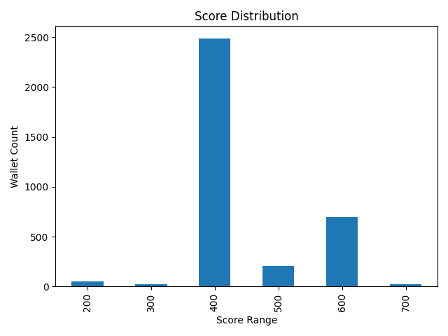

---

## 📊 `analysis.md`

Create `analysis.md` in the same folder and paste:

```markdown
# 📊 Wallet Score Analysis

This document analyzes the results of the scoring system applied to Aave V2 user wallets.

---

## 🔢 Score Distribution

| Score Range | Wallet Count | Risk Level |
|-------------|--------------|------------|
| 0–100       | ❌ High Risk  |
| 100–200     | ❌ High Risk  |
| 200–300     | ⚠️ Risky      |
| 300–400     | ⚠️ Risky      |
| 400–500     | ⚖️ Average    |
| 500–600     | ⚖️ Average    |
| 600–700     | ✅ Reliable   |
| 700–800     | ✅ Reliable   |
| 800–900     | 🟢 Very Good  |
| 900–1000    | 🟢 Excellent  |

(Exact values visible in `score_distribution.png`)

---

## 🟥 Low Score Behaviors (0–300)
- High liquidation count
- Low repay-to-borrow ratio (<0.3)
- Many borrow events, very few repayments
- Short active periods (e.g. < 7 days)

## 🟩 High Score Behaviors (700–1000)
- Repaid nearly all loans (repay/borrow > 0.9)
- Consistent activity across weeks/months
- Regular deposits and redemptions
- Never liquidated

---

## 📈 Score Chart


